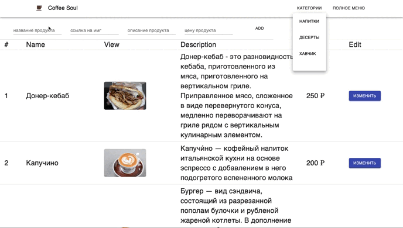

<h1>
CRM для кофейни
</h1>

Это приложение создано для менеджера кофейни.

Были реализованы все CRUD операции.

Весь проект делался в соло

  Был использован следующий стек:
  
 
 <u>Backend</u>:  <b> MongoDB, ExpressJS, Cors. </b> 

 
 <u>Frontend</u>:  <b> React, React-Router-Dom, React-Devtools, Logger </b> 

